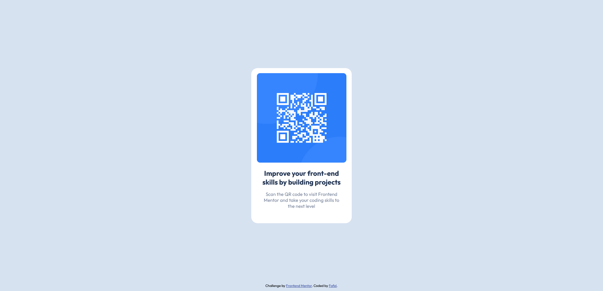

# Frontend Mentor - QR code component solution

## Welcome! 👋

This is a solution to the [QR code component challenge on Frontend Mentor](https://www.frontendmentor.io/challenges/qr-code-component-iux_sIO_H). Frontend Mentor challenges help you improve your coding skills by building realistic projects. 

## Table of contents

- [Overview](#overview)
  - [Screenshot](#screenshot)
- [My process](#my-process)
  - [Built with](#built-with)
  - [What I learned](#what-i-learned)
  - [Continued development](#continued-development)
- [Author](#author)

## Overview

### Screenshot

## My process

### Built with

- Semantic HTML5 markup
- CSS custom properties
- Flexbox
- Mobile-first workflow

### What I learned

By doing this exercise, I learned how to implement projects based only on design preview, HTML5 and CSS3, basic of Git and GitHub, CSS custom properties. 

### Continued development

 - In the future, I plan to further  deepen my knowledge of CSS3 by applying good practices in styling applications and websites. 
- I plan to learn SASS and JS and use them in future projects.

## Author

- Frontend Mentor - [@Fafel](https://www.frontendmentor.io/profile/Fafell)
- Twitter - [@Fafel](https://www.twitter.com/Fafffel)